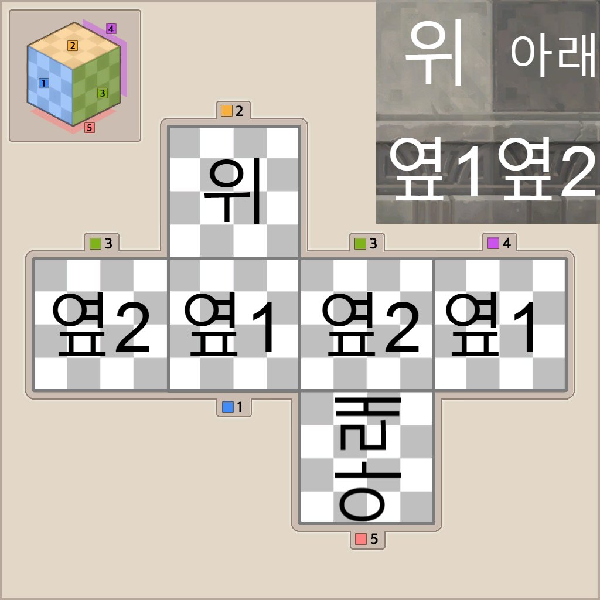

# MapleStory2Block

메이플스토리2의 블록 (큐브) 데이터를 공유하고, 공방 도안 제작 방법을 안내하는 페이지입니다.
> 원한다면 제시카의 집무실을 그대로 뜯어오는 것입니다.

# 준비물

## 블록 데이터

전체 블록 데이터를 다운로드 및 압축 해제합니다. (용량 1.25GB)
- https://drive.google.com/file/d/15R2OaTzbMaPW9lEVa79c34eDzInTC_6B/view?usp=sharing

## NIF 뷰어

블록 미리보기에 필요합니다. 추천하는 프로그램은 NifSkope입니다.
- 다운로드 링크 : https://github.com/niftools/nifskope/releases/download/v2.0.dev7/NifSkope_2_0_2018-02-22-x64.7z

## MintBot

- 아잉눈 Discord 서버 에서 사용 가능!
- 혹은 갠디로 사용 가능

# 도안 추출 과정 예시 1

- 추출할 블록의 위치를 대략 확인합니다. (트라이아)
 

- 블록 데이터에서 tria/cube 폴더 내용 중 해당 블록의 도안 파일 (dds) 을 찾습니다.

- (선택) 동일한 이름의 nif 파일을 NIF 뷰어로 열어서 원하는 블럭이 맞는지 확인합니다.

- MintBot이 볼 수 있는 곳에 dds파일을 올립니다.

- (참고) 이 dds 파일은 2x2로 총 4개 구역에 큐브 면 이미지가 들어있습니다.

- 일단 ==큐브2 명령어를 사용해 4개 면이 올바르게 분할되는지 살펴봅니다.

- (참고) 4개 면의 크기는 도안마다 다르므로, 최적의 분할 위치를 찾아야 합니다. MintBot이 어느정도는 자동으로 인식하긴 하지만, 보시다시피 이 도안은 이상하게 잘렸습니다. 망했습니다.

- (참고) MintBot은 좌측으로부터 133 픽셀, 상단으로부터 138 픽셀을 기준으로 잘랐습니다. 좌우 분할은 괜찮아 보이는데, 아무래도 상단에서 138픽셀 자른 게 너무 컸던 것 같습니다.

- MintBot에게 ==큐브2 133 131 를 입력합니다. 이는 상단으로부터 138 픽셀 대신 131 픽셀로 줄여서 자르도록 명령하는 것입니다.

- 이번엔 4개 면이 어느정도 깔끔하게 잘린 것 같습니다.

- 도안 출력을 위해 ==확정 을 입력합니다. 자동 생성된 도안이 수십 초 이내로 도착합니다.

- 우효!!

